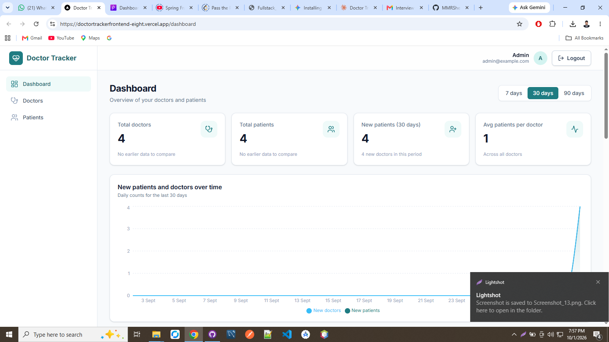
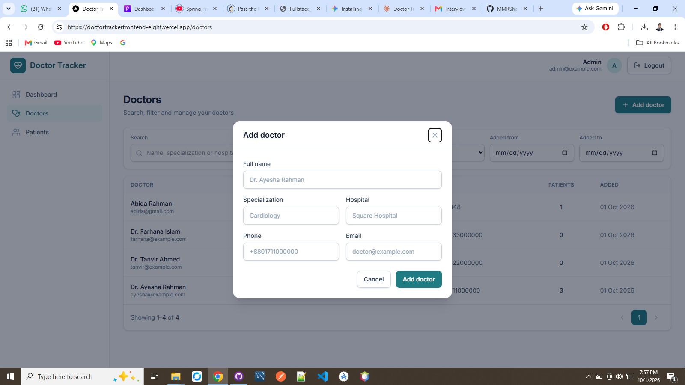
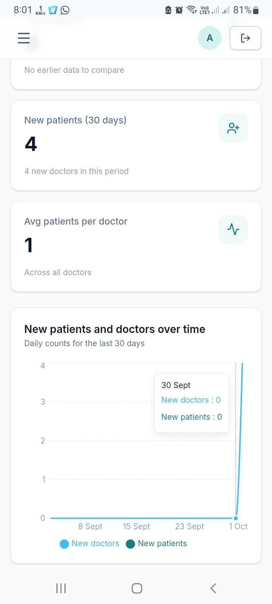
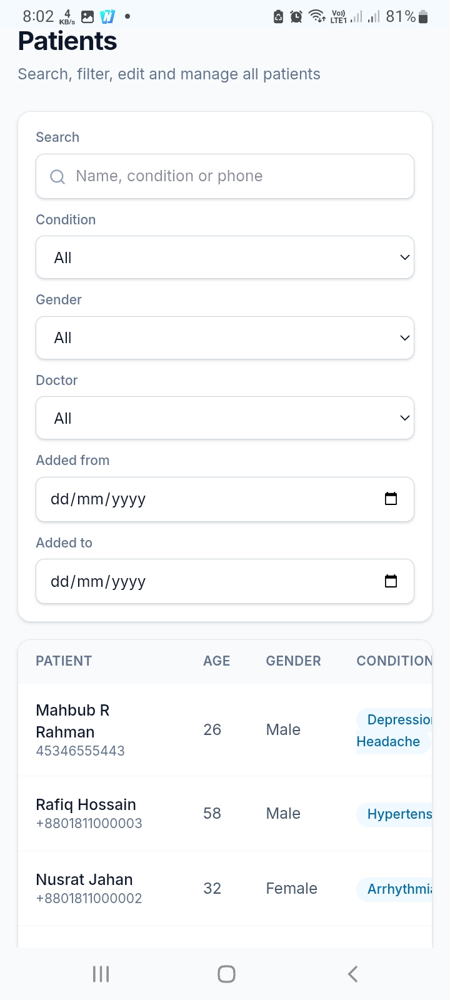

# DoctorTracker

# DoctorTracker

🚀 **Live Demo:** [https://doctortrackerfrontend-eight.vercel.app](https://doctortrackerfrontend-eight.vercel.app)


## Description

DoctorTracker is a comprehensive healthcare management platform designed to streamline appointment scheduling, patient tracking, and medical record access for both healthcare providers and patients. By providing a secure, real-time interface, DoctorTracker bridges the gap between doctors and patients—reducing administrative overhead, optimizing appointment workflows, and ensuring seamless access to vital health information anywhere, anytime.
Admin :  admin@example.com  
password : admin@123

## System Architecture

```
                                +-------------------+
                                |   Client Browser  |
                                | (Next.js Frontend)|
                                +---------+---------+
                                          |
                                          | HTTPS / REST API
                                          v
                                +-------------------+
                                | Express Backend   |
                                | (Vercel Serverless|
                                +---------+---------+
                                          |
                                          | Mongoose ORM
                                          v
                                +-------------------+
                                |   MongoDB Atlas   |
                                |  (Cloud Database) |
                                +-------------------+

```

DoctorTracker utilizes a decoupled client-server architecture built on the MERN stack ecosystem (Next.js, Express, Node.js, MongoDB):

* **Frontend Layer:** Built with Next.js, handling client-side state, server-side rendering (SSR), and routing seamlessly while serving requests directly to end-users.

* **Backend API Layer:** An Express.js RESTful API hosted as serverless functions on Vercel. It enforces JWT-based authentication, role-based access control (RBAC), and request validation.

* **Database Layer:** Hosted on MongoDB Atlas, storing structured document data including users, doctor profiles, schedules, and appointment records.

## Setup Guide

Follow these steps to set up and run DoctorTracker on your local machine.

### Prerequisites

* [Node.js](https://nodejs.org/) (v18.0.0 or higher)

* [npm](https://www.npmjs.com/) or [yarn](https://yarnpkg.com/)

* [MongoDB Community Server](https://www.mongodb.com/try/download/community) or a [MongoDB Atlas](https://www.mongodb.com/cloud/atlas) database connection string.

### Step 1: Clone the Repository

```
git clone https://github.com/your-username/CareGuide.git
cd CareGuide

```

### Step 2: Configure Environment Variables

#### Backend `.env.example`

Create a `.env` file in the `DoctorTracker/backend/` directory based on the following template:

```
# Server Configuration
PORT=5000
NODE_ENV=development

# Database Configuration
MONGODB_URI=mongodb+srv://<username>:<password>@cluster0.mongodb.net/doctor_tracker?retryWrites=true&w=majority

# Security & Authentication
JWT_SECRET=your_super_secret_jwt_key_here
JWT_EXPIRES_IN=7d

# CORS Allowed Origin
CLIENT_URL=http://localhost:3000

# Admin Seed Credentials
ADMIN_EMAIL=admin@doctortracker.com
ADMIN_PASSWORD=SuperSecurePassword123!

```

#### Frontend `.env.example`

Create a `.env.local` file in the `DoctorTracker/frontend/` directory based on the following template:

```
# Public API Endpoint
NEXT_PUBLIC_API_URL=http://localhost:5000/api

```

### Step 3: Backend Setup

1. Navigate to the backend directory:

   ```
   cd DoctorTracker/backend
   
   ```

2. Install dependencies:

   ```
   npm install
   
   ```

3. Seed the initial admin user (optional):

   ```
   node scripts/seedAdmin.js
   
   ```

4. Start the backend development server:

   ```
   npm run dev
   
   ```

   *Backend will run on `http://localhost:5000`*

### Step 4: Frontend Setup

1. Open a new terminal and navigate to the frontend directory:

   ```
   cd DoctorTracker/frontend
   
   ```

2. Install dependencies:

   ```
   npm install
   
   ```

3. Start the Next.js development server:

   ```
   npm run dev
   
   ```

   *Frontend will run on `http://localhost:3000`*

## Technical Decisions

### 1. Next.js App Router over Vite / Create React App

* **Context:** We needed an interactive, highly responsive user interface with good SEO capabilities for public doctor directory listings, alongside strong performance for administrative dashboards.

* **Decision:** We chose **Next.js** instead of a single-page React application built with Vite or Create React App.

* **Rationale:** Next.js provides hybrid rendering capabilities (Server Components and Client Components out of the box). This allows us to serve pre-rendered public doctor profiles for fast initial loading speeds and SEO advantages, while maintaining interactive client-side routing for the patient/admin dashboards. Additionally, native deployment compatibility with Vercel eliminates complex route rewrite configurations (e.g., `vercel.json` SPA fallbacks).

### 2. Standardized RESTful Express API over Next.js API Routes

* **Context:** When designing the backend, we evaluated building full API routes directly within Next.js versus maintaining a separate Node.js/Express backend service.

* **Decision:** We chose to keep a decoupled **Node.js/Express API server**.

* **Rationale:** Decoupling the backend from the Next.js frontend ensures strict separation of concerns. It allows independent scaling, deployment, and testing of database models and business logic. Furthermore, this modular architecture leaves the backend ready to support potential future mobile client applications (React Native/iOS/Android) without needing to re-architect or tightly bind business logic to web server routes.

## Visual Evidence

*(Ensure image files are saved inside the `pics/` folder in your repository)*

### Desktop View

| View | Screenshot |
| :--- | :--- |
| **Desktop Dashboard** |  |
| **Doctor Directory** |  |

### Mobile View

| View | Screenshot |
| :--- | :--- |
| **Mobile Navigation** |  |
| **Mobile Patient List** |  |
